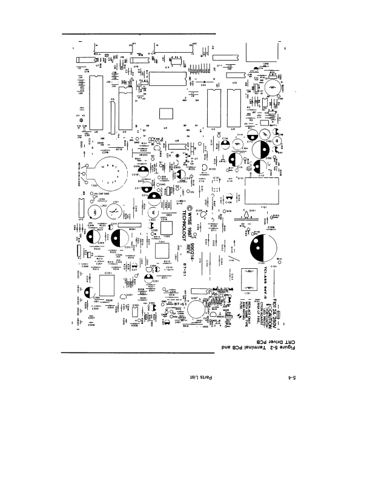
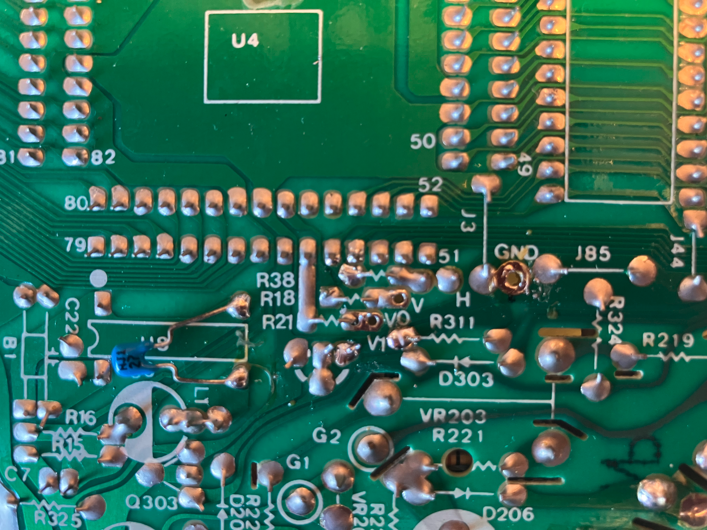

# Hardware design

Canonical hardware, signal, and timing notes for replacing U4 with an RP2040. Firmware phasing lives in [firmware-plan.md](firmware-plan.md). The Pico + 74AHCT125 carrier is the KiCad protoboard in [kicad/crt-drive/](kicad/crt-drive/); power nets are in [kicad/power_supply.md](kicad/power_supply.md).

Status language used below: **Decided**, **Working hypothesis**, **Open**.

## PCB identity

**Decided.** Visual inspection and schematic check: the Link MC5 main logic board is the Wyse WY-120 architecture (`© 1993 WYSE` PCB marking).



### Component map

| Component ID | Part Number | Package | Role |
| --- | --- | --- | --- |
| U4 (ASIC) | Wyse 211009-02 | QFP-100 | Display controller / CRTC / timing |
| MCU | Intel P80C32 | DIP-40 | 8051-family CPU (emulation, I/O) |
| Firmware ROM | 27C512-12 (`VER 3.04`) | DIP-32 | 64 KB EPROM |
| VRAM (x2) | Winbond W2465-70LL | DIP-28 | 8K x 8 SRAM (16 KB total) |
| Buffer | SN74LS377N | DIP-20 | Octal DFF (attribute / control) |
| Clock | XO-10 | Can | 48.000 MHz master oscillator |
| Video buffer | IC401 | DIP / SOIC | Input stage for CRT video amp |

## Topology

### Legacy

```text
[ P80C32 MCU ] <== Address/Data ==> [ 27C512 EPROM ]
      ||
      v
[ Wyse 211009-02 ASIC ] <== 8-bit ==> [ Winbond W2465 SRAM x2 ]
 (48.0 MHz Crystal)
      ||
      +==> /HSYNC (Pin 53) =======> [ Horizontal Deflection ]
      +==> /VSYNC (Pin 59) =======> [ Vertical Deflection ]
      +==> Video 0 / Dim (Pin 64) => [ 100 ohm ] ==> Coax (White) ==> [ IC401 ] ==> [ CRT Cathode ]
      +==> Video 1 / Norm (Pin 61)=> [ 100 ohm ] ==> Coax (Red)   ==> [ IC401 ] ==> [ CRT Cathode ]
```

### RP2040 replacement

**Decided** injection path: solder-side pads labeled V0, V1, V, H, and GND next to U4 ([signals_pcb.png](signals_pcb.png)). PIO state-machine assignment is **Open** (see [firmware plan](firmware-plan.md)). The diagram uses the CMake-aligned three-SM recommendation.

```text
[ RP2040 SRAM Framebuffer ] (800x338 @ 2-bit, 67.6 KB)
      ||
      v (Paced DMA)
[ PIO SM0 (Pixel) ] ======> [ 74AHCT125 ] ==> pads V0 / V1 --> neck board
[ PIO SM1 (/HSYNC)] ======> [ 74AHCT125 ] ==> pad H         --> H-deflection
[ PIO SM2 (/VSYNC)] ======> [ 74AHCT125 ] ==> pad V         --> V-deflection
  (144 MHz sys_clk / 3 = 48 MHz dot clock)
```

The original CPU and RAM bus do not need to be functional. Onboard XO-10 is unused; the RP2040 **PLL_SYS** generates the dot clock (78 Hz pattern: 144 MHz / 3 = 48 MHz; 60 Hz `cross60`: 128.4 MHz / 4 = 32.1 MHz).

## Signals

### Pinout and polarity

U4 pin numbers identify the ASIC nets. Physical attach is the labeled pads, not flywires to the QFP.

| Signal | U4 pin | Polarity | Nominal rate | Path |
| --- | --- | --- | --- | --- |
| /HSYNC | 53 | Active-low TTL | 31.373 kHz (78 Hz mode) | Solder-side pad **H** → horizontal deflection |
| /VSYNC | 59 | Active-low TTL | 78.041 Hz (first target) | Solder-side pad **V** → vertical deflection |
| V0 / Dim | 64 | Active-high TTL | Pixel rate | Solder-side pad **V0** → neck board |
| V1 / Normal | 61 | Active-high TTL | Pixel rate | Solder-side pad **V1** → neck board |

R18 and R21 sit next to the V0/V1 pads (on-board damping). Driving the V0/V1 pads from 5 V level-shifted RP2040 outputs gives four brightness levels.

### 2-bit luminance

| V0 (Dim) | V1 (Normal) | Beam current | Pixel state |
| --- | --- | --- | --- |
| 0 (0 V) | 0 (0 V) | Off | Blank / black |
| 1 (+5 V) | 0 (0 V) | Low | Dim text |
| 0 (0 V) | 1 (+5 V) | Medium | Normal text |
| 1 (+5 V) | 1 (+5 V) | High | Bold / high intensity |

## Level shift (3.3 V to 5 V TTL)

RP2040 GPIO is 3.3 V CMOS. CRT drive expects 5 V TTL, so translation is required.

**Decided (recommended part):** 74AHCT125 quad bus buffer, VCC = +5 V.

| Parameter | 74AHCT125 |
| --- | --- |
| VIH | 2.0 V (accepts 3.3 V Pico highs) |
| Propagation delay | ~3.8 ns (fine at 48 MHz) |

**Alternative:** 74HCT245 if more channels are needed.

Tie all /OE pins to GND so outputs stay enabled.

### GPIO map

| Pico GPIO (3.3 V) | 74AHCT125 | CRT side |
| --- | --- | --- |
| GPIO 0 (V0) | 1A pin 2 → 1Y pin 3 | Pad **V0** (neck video, dim) |
| GPIO 1 (V1) | 2A pin 5 → 2Y pin 6 | Pad **V1** (neck video, normal) |
| GPIO 2 (/HSYNC) | 3A pin 9 → 3Y pin 8 | Pad **H** |
| GPIO 3 (/VSYNC) | 4A pin 12 → 4Y pin 11 | Pad **V** |
| GPIO 4 (78 Hz V-size) | unbuffered 3.3 V (AHCT is full) | **U6 pin 5** — high only in 78 Hz; selects **VR301**. Lift the 8032 pin first if that MCU is still driving it. |
| GND | Pin 7 and all /OE | Pad **GND** (common with Pico) |
| Pico VSYS / AHCT VCC | — | Logic-board **+5 V** (on-board; no pad ID claimed) |

```text
Pico GPIO (3.3V)           74AHCT125 (VCC = 5V)              CRT pads (solder side, near U4)
----------------            -------------------              --------------------------------
GPIO 0 (V0 Pixel)    --->   1A (Pin 2)  -> 1Y (Pin 3)   --->  V0
GPIO 1 (V1 Pixel)    --->   2A (Pin 5)  -> 2Y (Pin 6)   --->  V1
GPIO 2 (/HSYNC)      --->   3A (Pin 9)  -> 3Y (Pin 8)   --->  H
GPIO 3 (/VSYNC)      --->   4A (Pin 12) -> 4Y (Pin 11)  --->  V
GPIO 4 (78 Hz V-size)--->   (no spare AHCT gate)        --->  U6 pin 5 / VR301 select
GND                  --->   GND (Pin 7), /OE to GND     --->  GND
Logic-board +5 V     --->   J1 → U1 VCC (Pin 14); D1 → Pico VSYS
```

### Injector protoboard (Pico carrier)

**Decided.** Hand-wired through-hole protoboard (KiCad 10), not a fabbed 2-layer PCB. Schematic and jumper layout: [kicad/crt-drive/](kicad/crt-drive/). Power: [kicad/power_supply.md](kicad/power_supply.md).

| Ref | Part | Role |
| --- | --- | --- |
| A1 | Raspberry Pi Pico | RP2040; VSYS on pin 39, GND tap pin 38 |
| U1 | 74AHCT125 | 3.3 V → 5 V TTL, `/OE` tied to GND |
| J1 | 1×2 | Logic-board **+5 V** / **GND** |
| J2 | 1×5 | Harness **V0 V1 H V GND** (after series resistors) |
| R1, R2 | 100 Ω | Damping on V0 / V1 |
| R3, R4 | 47 Ω | Damping on H / V (47–68 Ω band) |
| D1 | 1N5817 | +5 V → VSYS; blocks USB back-feed |
| FB1 | 100 Ω @ 100 MHz | Isolates `+5V_BUFFER` for U1 |

## Isolation and injection

**Decided.** The guessed TP1 / U4 pin-59 flywire / coax / lift-R402/R404 path was wrong. Factory jumpers as previously described were not present. Access is the solder side of the logic PCB (a few screws).



Solder side under U4: silkscreen **V0**, **V1**, **V**, **H**, **GND**. The photo shows V1, V0, and GND desoldered; those wires ran to the CRT neck board. H and V wires were lifted later and spliced.

Prevent contention with U4 by lifting the factory harness at the pads, then driving the load-side wires:

1. Remove the logic PCB (few screws).
2. Locate labeled pads V0, V1, V, H, and GND near U4.
3. Lift the factory wires at V0, V1, and GND (neck-board video and ground). Lift H and V the same way. Splice the 74AHCT125 outputs into those load-side wires so U4 is isolated.
4. Power the Pico and 74AHCT125 from logic-board +5 V and GND.

## Video timings

### 60 Hz 80-col (first target)

Pico **PLL_SYS** 128.4 MHz / PIO clkdiv 4 → **32.1 MHz** dots. 80-col **800** × **416**, **1024** clocks/line. fH = 31.348 kHz, 523 lines → 59.938 Hz. [`apps/cross60`](../apps/cross60/) (`make test`).

HIL box on glass: **22.5 × 17.0 cm** (diag **28.3 cm**). Sides were 1.4 / 1.1 cm before the 5-dot `/HSYNC`; V at VR302 min ≈ 11 mm. Grid is 40×26 px so cells are nearly square on this mm/px (not 80×16 text blocks); glass **1.1 × 1.0 cm**.

| Clock | Value |
| --- | --- |
| `sys_clk` | 128.400 MHz |
| PIO clock divider | 4.00 |
| Dot clock | 32.100 MHz (31.153 ns/dot) |

#### Horizontal (/HSYNC)

| Stage | Dots | Time |
| --- | --- | --- |
| Active video | 800 (80 × 10) | 24.922 us |
| Front porch | 113 | 3.520 us |
| Sync pulse (active-low) | 111 | 3.458 us |
| Back porch | 0 | 0 |
| **Total line** | **1024** | **31.963 us (fH = 31.348 kHz)** |

#### Vertical (/VSYNC)

| Stage | Scanlines | Time |
| --- | --- | --- |
| Active display | 416 (26 × 16) | 13.277 ms |
| Front porch | 50 | 1.596 ms |
| Sync pulse (active-low) | 6 | 0.191 ms |
| Back porch | 51 | 1.628 ms |
| **Total frame** | **523** | **16.687 ms (fV = 59.938 Hz)** |

### 60 Hz 132-col

Appendix B: 1188 dots × 416 lines, 9×16 cells. Same PLL_SYS **128.4 MHz** (USB stays up); PIO clkdiv **2.675** → **~47.988 MHz** dots. Line **1530** so fH stays ~31.37 kHz. Porches are the 80-col 113/111/0 split scaled onto that line (sync still ~3.46 us). USB `m` in [`apps/cross60`](../apps/cross60/).

| Clock | Value |
| --- | --- |
| `sys_clk` | 128.400 MHz |
| PIO clock divider | 2.675 (2 + 173/256) |
| Dot clock | 47.988 MHz (20.838 ns/dot) |

#### Horizontal (/HSYNC)

| Stage | Dots | Time |
| --- | --- | --- |
| Active video | 1188 (132 × 9) | 24.756 us |
| Front porch | 176 | 3.668 us |
| Sync pulse (active-low) | 166 | 3.459 us |
| Back porch | 0 | 0 |
| **Total line** | **1530** | **31.883 us (fH = 31.365 kHz)** |

Vertical table is the 80-col 60 Hz frame (416/50/6/51, 523 lines, ~59.97 Hz).

### 78 Hz (`cross60` HIL, then pattern app)

[`apps/cross60`](../apps/cross60/) USB `r` uses the **same H as the current column mode** (80-col 1024-dot 32.1 MHz, 132-col 1530-dot ~48 MHz) so L201 width stays. Vertical wrap stays **402** lines. HIL active is **377** (13 × 29). Factory ASIC ran 78 Hz 80-col as 800/1530 @ 48 MHz; that would shrink the 80-col box on this HIL. Glass: **1 cm** L/R, ~**1.65 cm** V, ~1 cm cells. Record: [test-pattern-design.md](test-pattern-design.md) (standalone measure).

#### Vertical (`cross60` 78 Hz, decided)

| Stage | Scanlines | Time (80-col H, 31.348 kHz) |
| --- | --- | --- |
| Active display | 377 (13 × 29) | 12.033 ms |
| Front porch | 11 | 0.351 ms |
| Sync pulse (active-low) | 6 | 0.191 ms |
| Back porch | 8 | 0.255 ms |
| **Total frame** | **402** | **12.831 ms (fV ≈ 77.94 Hz)** |

**Working hypothesis** for porch *widths* on the pattern app (`make test APP=pattern`): 144 MHz / clkdiv 3 → 48 MHz dots, 1530-dot line, **338** active. Do not fold 377-line geometry into that app until the checklist in the test-pattern doc is applied.

| Clock | Value |
| --- | --- |
| `sys_clk` | 144.000 MHz |
| PIO clock divider | 3.00 |
| Dot clock | 48.000 MHz (20.833 ns/dot) |

#### Horizontal (/HSYNC)

| Stage | Dots | Time |
| --- | --- | --- |
| Active video | 800 (80 × 10) | 16.667 us |
| Front porch | 160 | 3.333 us |
| Sync pulse (active-low) | 140 | 2.917 us |
| Back porch | 430 | 8.958 us |
| **Total line** | **1530** | **31.875 us (fH = 31.373 kHz)** |

During active display, /HSYNC stays high; it pulses low for the 140-dot sync interval.

#### Vertical (/VSYNC)

| Stage | Scanlines | Time |
| --- | --- | --- |
| Active display | 338 (26 × 13) | 10.774 ms |
| Front porch | 10 | 0.319 ms |
| Sync pulse (active-low) | 6 | 0.191 ms |
| Back porch | 48 | 1.530 ms |
| **Total frame** | **402** | **12.813 ms (fV = 78.041 Hz)** |

## Manual cross-references

Wyse WY-120 Maintenance Manual, document **880491-01**:

| Location | What it covers |
| --- | --- |
| Table 4-2 | 211009 ASIC signal definitions (pins 53, 59, 61, 64) |
| Figure 4-17 | Video amp: V0/V1 through damping resistors into R404/R402 and IC401 |
| Section 6 | Schematics; buffering between the ASIC and header P5 |
| Appendix B | Scan frequency 31.372 kHz; 78.041 Hz / 59.999 Hz; 800×338 @ 78 Hz |

## Diagnostic patterns (hardware use)

These are visual targets for analog setup. Drawing coordinates live in [test-pattern-design.md](test-pattern-design.md); PIO / DMA how-to is in [firmware-plan.md](firmware-plan.md). USB CDC selects a pattern; a short BOOTSEL press cycles them on the bench.

- **Sync-squares:** raster-edge box, 100 mm scale square (sized for the bezel), 80 × 80 px box, and a short center cross. This MC5 bezel is **24.6 cm × 19.0 cm**.
- **60/78 Hz measure:** [`apps/cross60`](../apps/cross60/) (`make test`, then `make monitor`). Boot is 60 Hz 80-col box + **40×26** grid (**20×16** cells). `m` 132-col (**22×16** / 54×26). `r` 78 Hz (**20×13** / **22×13** on 377 lines, vbp=8). 78 Hz glass: **1 cm** L/R; V centered ~**1.65 cm** top/bottom; ~1 cm cells. `a`/`d` H phase, `w`/`s` V porch. 60 Hz box **22.5 × 17.0 cm** (diag 28.3 cm).
- **Crosshatch:** bold overscan box, vertical every 80 pixels, horizontal every 13 lines, bold center reticle (size, centering, linearity, pincushion).
- **Intensity bars:** four bands `00` / `01` / `10` / `11` (brightness and contrast).
- **Focus matrix:** dense `H` in 10 × 13 cells (flyback / neck focus).
- **Indian Head:** letterboxed RCA card plus V0-only / V1-only / bold patches and resolution bursts.
- **Full-on box:** every pixel bold (beam current and overscan limits).
