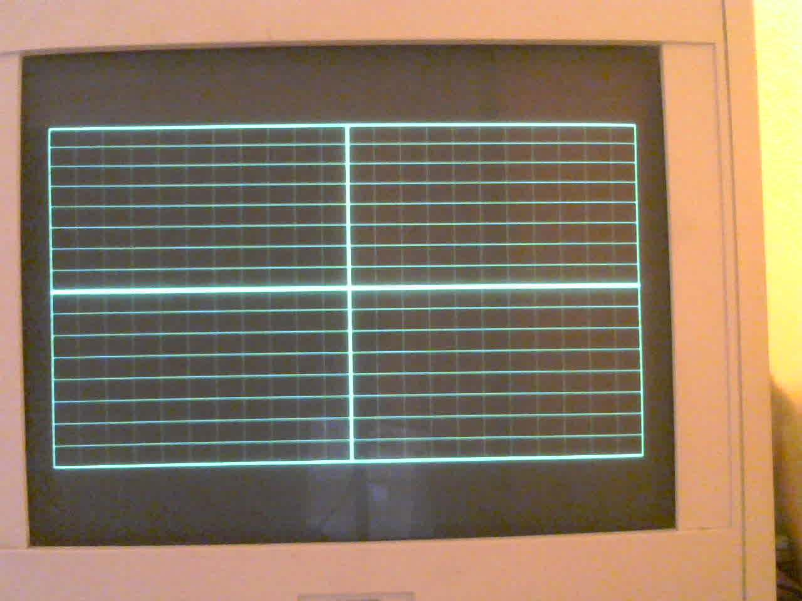
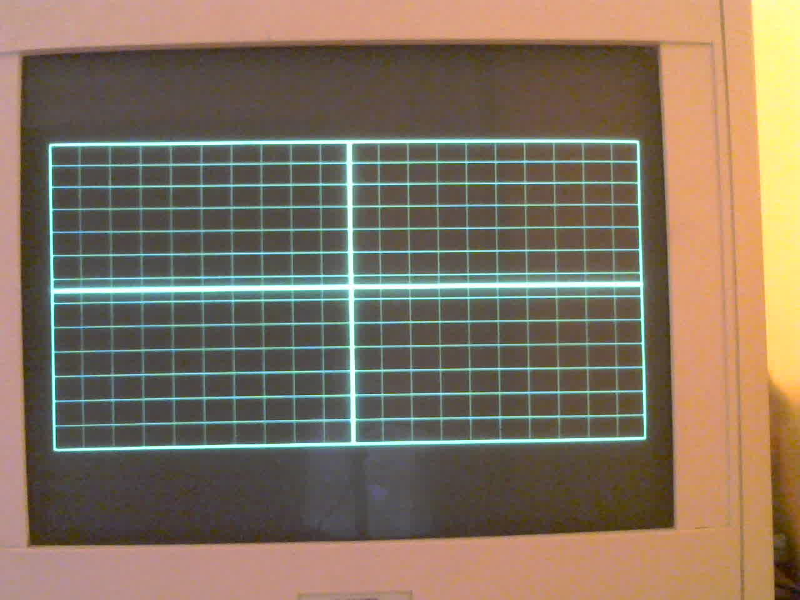
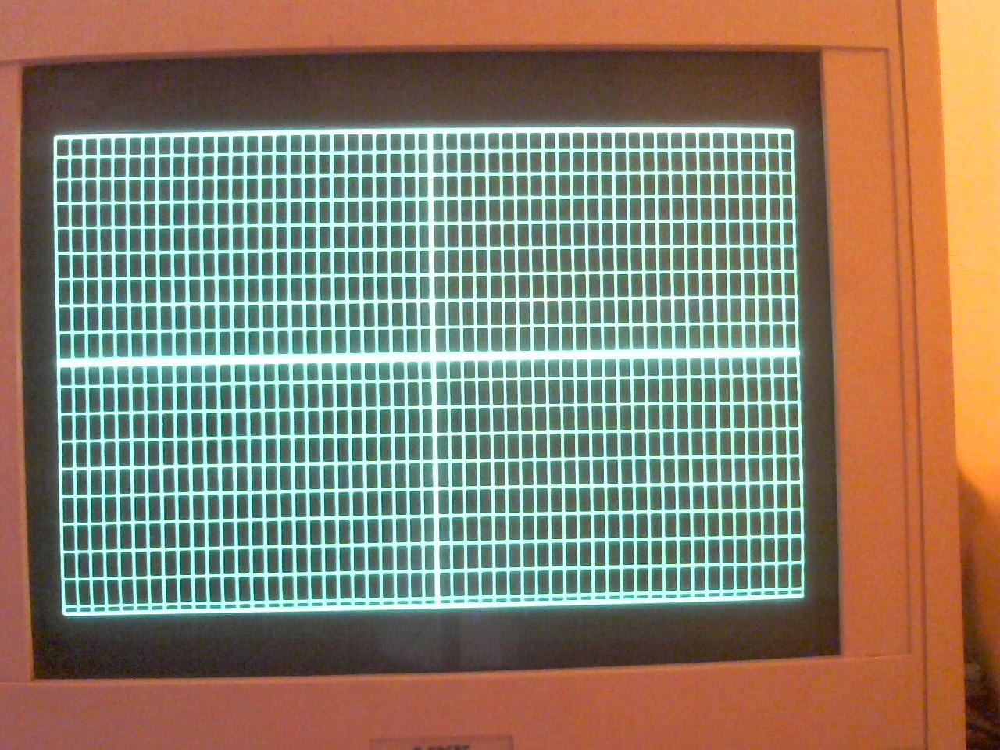

# Project writeup

Programmable CRT drive for the Link MC5 (Wyse WY-120 architecture). A Raspberry Pi Pico synthesizes the sync and video the tube already expects, in place of the Wyse 211009-02 display ASIC. This note is the narrative of how that replacement is built and checked. Pin tables, porch counts, and generator coordinates stay in the design docs linked from each section.

## Methodology

The original CPU, EPROM, and VRAM stay out of the path. The Pico drives the deflection and neck boards with the four signals those boards already take from the ASIC: active-low `/HSYNC` and `/VSYNC`, and active-high dual video (V0 dim, V1 normal).

Work follows a fixed order, and each step keeps its own evidence.

1. **Read the manual, then the board.** Wyse WY-120 Maintenance Manual 880491-01 (Table 4-2, Figure 4-17, Appendix B) names the ASIC pins, the video-amp path, and the two scan rates (about 31.37 kHz horizontal, 60 Hz and 78 Hz vertical). The chassis we have is checked against that text. Where the board disagrees with an earlier guess, the board wins. Factory jumpers, a TP1 flywire, and a coax tap were not the injection points; the solder-side pads next to U4 are.

2. **Isolate, then inject.** The ASIC is taken off the harness by lifting the load-side wires at the labeled pads. The Pico never shares a net with a still-driven U4 output. Level shift and power are a separate carrier, fed from the logic-board +5 V rail.

3. **Scope the edges, then look at the glass.** Line rate, frame rate, polarity, and a gap-free 2-bit pixel stream are confirmed on GPIO before the tube is driven. Geometry, centering, linearity, and retrace are properties of this yoke. They are settled by measuring the phosphor, then writing the porch widths that produced that picture.

4. **Lock one analog setup.** 60 Hz is centered with the chassis pots (VR302 vertical size, VR303 linearity, L201 width) to the factory margin, about 11 mm. 78 Hz reuses that horizontal sweep. Its extra height is a firmware vertical raster plus the 78 Hz size pot (VR301), selected by a GPIO. The shared linearity pot is left where 60 Hz put it.

5. **Keep one system clock.** `PLL_SYS` stays at 128.4 MHz in every mode so USB serial survives a mode change. 80-column and 132-column are PIO clock dividers on that PLL. Refresh rate is which vertical program is loaded, and how many active lines DMA walks.

6. **Change one variable, and write the number down.** Porch order, sync width, active-line count, and pot turns are recorded separately. A top gap that survives a back-porch edit is a yoke fact. A top line that appears in retrace is a blanking fact. Those readings live in [test-pattern-design.md](test-pattern-design.md) as the HIL record.

7. **Two evidence channels.** USB CDC, with a unique `digest=` baked into the image, proves which firmware is running. The face of the tube proves what the yoke did with those edges. A host with no Pico is recorded as a skip.

CRT anode and flyback voltages stay lethal for the whole loop. The chassis is driven only after the harness is lifted and the anode discharge path is known. USB-only firmware (`make test APP=hello`) is the bring-up of the Pico, and is a separate step from driving the tube.

## Hardware

**Target.** Link MC5 main logic board, Wyse WY-120 architecture, PCB marked `© 1993 WYSE`. The part being replaced is U4, Wyse 211009-02, QFP-100, display controller. The Intel P80C32, 27C512 (`VER 3.04`), and two Winbond W2465 SRAMs can sit idle. The onboard 48 MHz oscillator is unused; the Pico PLL makes the dot clock.

**Injection.** Solder side of the logic PCB, a few screws to remove the board. Silkscreen next to U4 labels **V0**, **V1**, **V**, **H**, and **GND** ([signals_pcb.png](signals_pcb.png)). Those wires are the neck-board video and ground, and the horizontal and vertical deflection feeds. The factory wires are lifted at the pads and spliced to the carrier, so U4 is off the load.

| Signal | U4 pin | Polarity | Pico GPIO | Carrier | Pad |
| --- | --- | --- | --- | --- | --- |
| V0 dim | 64 | Active-high TTL | 0 | 74AHCT125 1A→1Y | V0 |
| V1 normal | 61 | Active-high TTL | 1 | 74AHCT125 2A→2Y | V1 |
| /HSYNC | 53 | Active-low TTL | 2 | 74AHCT125 3A→3Y | H |
| /VSYNC | 59 | Active-low TTL | 3 | 74AHCT125 4A→4Y | V |
| 78 Hz V-size | — | High selects VR301 | 4 | Unbuffered 3.3 V to U6 pin 5 | — |

GPIO is 3.3 V CMOS. The neck and deflection inputs are 5 V TTL. U1 is a 74AHCT125 (VIH 2.0 V, a few nanoseconds of delay, all `/OE` tied to ground). Series damping on the harness connector is 100 Ω on V0 and V1, and 47 Ω on H and V. R18 and R21 remain on the logic board beside the video pads.

Four brightness steps come from the two video bits: both low is blank, V0 alone is dim, V1 alone is normal, both high is bold.

**Power.** Logic-board +5 V and GND into connector J1 on the carrier. A 1N5817 feeds Pico VSYS and blocks USB from back-feeding the terminal rail. A ferrite isolates a quiet 5 V rail for the 74AHCT125. Detail is in [kicad/power_supply.md](kicad/power_supply.md). The carrier itself is a hand-wired through-hole protoboard in [kicad/crt-drive/](kicad/crt-drive/).

**Raster the yoke accepted.** Appendix B is the starting point (800×338 at 78 Hz, 48 MHz dots, 1530-dot line). On this tube the useful rasters are the ones in [hardware-design.md](hardware-design.md):

| Mode | Dot clock | Line | Active | Vertical |
| --- | --- | --- | --- | --- |
| 60 Hz 80-col | 32.1 MHz (clkdiv 4) | 1024 | 800 × 416 | 523 lines, 50 / 6 / 51 |
| 60 Hz 132-col | ~48 MHz (clkdiv 2.675) | 1530 | 1188 × 416 | same 523-line frame |
| 78 Hz 80-col | same 32.1 MHz | 1024 | 800 × 377 | 402 lines, 11 / 6 / 8 |
| 78 Hz 132-col | same ~48 MHz | 1530 | 1188 × 377 | same 402-line frame |

Horizontal timing stays with the column count, so the width coil does not move when refresh changes. 78 Hz active height is 377 lines (13 × 29). The manual’s 338-line character raster left a short picture on this yoke once 60 Hz had been set to the 11 mm margin. Painting past about 0.5 ms after `/VSYNC` put the top edge into retrace.

## Software

All CRT images share one scanout, [`video/scanout.c`](../video/scanout.c). A packed framebuffer in SRAM is DMA’d into a pixel PIO state machine. Two more state machines make `/HSYNC` and `/VSYNC`. The vertical machine waits on an IRQ from the horizontal machine, so the frame stays locked to the line.

```text
framebuffer (2 bpp, MSB first)
        |  DMA, one line per hsync RX word
        v
SM0  out pins, 2   GPIO 0-1   V0 / V1
SM1  /HSYNC        GPIO 2     pad H
SM2  /VSYNC        GPIO 3     pad V          IRQ 0 from SM1
GPIO 4             78 Hz V-size select
```

The pixel machine is `out pins, 2` with a joined TX FIFO. Blanking is a stall on an empty FIFO, plus four trailing zero bytes (16 dark pixels) at the end of each stored line. Horizontal position is a few leading zero words (`a` / `d` on USB, 16 pixels per step). Vertical position is the back-porch count (`w` / `s`, one line per step). Both rewrite the DMA line table while the state machines keep running.

Packing is 4 pixels per byte, shift-left, 32-bit little-endian DMA, so `scanout_set_pixel` stores at `(x/4) ^ 3`. An 80-pixel grid hid that swap. A 40-pixel grid showed it as alternating 24- and 56-pixel gaps.

`PLL_SYS` is programmed once at 128.4 MHz. 132-column loads a different horizontal PIO program and a divider of 128.4 MHz / 48 MHz. 78 Hz loads the 402-line vertical program and drives GPIO 4 high. Mode changes are USB keys `m` (80 / 132) and `r` (60 / 78) in the measure, pattern, and demo images.

Each application is its own CMake project and UF2. `make build` with no `APP` is the measure image.

| `APP` | UF2 | Role |
| --- | --- | --- |
| `cross60` (default) | `crt_cross60` | Box, grid, and plus for deflection. Boot is 60 Hz 80-column. |
| `pattern` | `crt_pattern` | Six analog-setup drawings on the same four modes. |
| `term` | `crt_term` | Glass TTY. Boots 78 Hz 80-column. Host bytes are the session. |
| `demos` | `crt_demos` | Phosphor reel (starfield, radar, Lissajous, XOR, wireframe, text). |
| `hello` | `hello_pico` | USB bring-up. LED and CDC ping. No CRT pins. |

The terminal keeps a character grid and blits a 7×10 cell font into the framebuffer ([terminal-plan.md](terminal-plan.md)). The reel fades 2-bit pixels in place (`11` → `10` → `01` → `00`) so trails read on a short-persistence phosphor ([demo-plan.md](demo-plan.md)). A separate TrueType path in [`font/`](../font/) scales an em from the measured millimeters per pixel so type is square on this glass.

USB CDC is the control port (`tools/monitor.py`, `make monitor`). The running image prints a banner; the host script follows that banner. Pattern keys, scene keys, and TTY bytes are different dialects, so a measure session does not type into the glass TTY.

## HIL

Firmware is built in Docker on the machine the Pico is plugged into. The image is `crt-drive/pico-dev:local` (ARM GCC, CMake, Ninja, Pico SDK and picotool 2.1.1). The repository is bind-mounted at `/workspace`. There is no second computer in the flash path. Host installs of the SDK or `gcc-arm-none-eabi` are out of the procedure. Commands are `make` targets from the repository root ([toolchains.md](toolchains.md)).

The loop is:

1. `make pico-discover` — `2e8a:000a` means an application is up (CDC). `2e8a:0003` means BOOTSEL. Neither ID means skip the hardware check and say so.
2. Edit sources in this tree.
3. `make build` or `make build APP=…`.
4. `make test` — stamps a unique `IMAGE_ID`, flashes, and reads the banner back. `make test APP=hello` expects `digest=` and `pong`. The default app expects the `crt-cross60` banner. `APP=pattern` checks the drawing banner. `APP=term` sends a canned UTF-8 line. `APP=demos` sends `2` and expects `scene=radar`.
5. `make monitor` attaches to whatever image is already running, for keys and typed bytes.

Flash reboots the application into BOOTSEL (`picotool reboot -u -f`) and then loads. The CDC serial number and the RP2 boot serial number differ, so a forced load against the running ID waits for a device that will not reappear.

A green Ninja build is the compile. The hardware pass is the banner that contains the digest just flashed. An empty `lsusb` for `2e8a` prints `HIL skip` and is a recorded absence, not a pass.

That USB loop proves the image, the clock, and the command path. Sync rate and pixel-stream integrity were checked on a scope before the tube. Deflection, margins, cell pitch, and retrace are the glass record in [test-pattern-design.md](test-pattern-design.md). `make camera-check` is the live gate on that glass: the C310 view must hold the full raster inside the picture before a still is trusted. The four mode frames from that camera are below.

## Camera on glass

USB can name the firmware. The phosphor is where that firmware becomes a picture: box size, cell pitch, a missing top line, a hair of the frame in retrace, bloom on the bold level. Those used to be ruler readings taken at the tube and typed into the HIL record. A camera on the face makes the same reading a frame on the Dev-Host, taken in the same session as the CDC banner.

**Instrument.** Logitech Webcam C310, USB ID `046d:081b`, on the same host and the same bus as the Pico (`2e8a:000a`). It sits on the glass for a full-frame view of the phosphor and the bezel, which is the reference the margins are measured against.

**What a frame is for.** The measure image (`crt_cross60`) is the subject: bold raster box, normal grid, bold plus. One still per mode (60/78 × 80/132), shot while `make monitor` is showing the banner that names the mode and the porch (`hpad`, `vbp`, `vfp`). The banner is the label. The frame is the measurement.

**These four frames.** C310 MJPEG at 1280×960, from `/tmp/crt-modes/`. Each mode was an eight-frame burst. Frames 01 and 06 match, 02 and 05 match, 03 and 04 match; the unnumbered file matches frame 08. The burst is the same raster at different phosphor brightness (refresh against the shutter). The keeper is that last frame. 132-column packs the verticals tighter inside the same sweep. 78 Hz shortens the box and opens the top and bottom margins, with the horizontal width left where 60 Hz set it.


*60 Hz 80-column. Boot measure pattern.*



*60 Hz 132-column. Same vertical sweep, 54×26 grid.*



*78 Hz 80-column. 377-line raster, 40×29 grid, `vbp=8`.*


*78 Hz 132-column. Same 402-line frame as 78 Hz 80-column, 54×29 grid.*

The ruler readings these frames are checked against:

| | 60 Hz | 78 Hz |
| --- | --- | --- |
| Bezel | 24.6 × 19.0 cm | same |
| Active box | 22.5 × 17.0 cm (diag 28.3 cm) | height follows 377 lines on the 60 Hz analog setup |
| Side margins | ~1 cm after the 111-dot `/HSYNC` | ~1 cm (width coil unchanged) |
| Top and bottom | ~11 mm at VR302 minimum | ~1.65 cm at `vbp=8` |
| Grid cell | ~1.1 × 1.0 cm (40 × 26 px pitch) | ~1 cm (40 × 29 px pitch) |

Pixel pitch on the 60 Hz box is 0.281 mm horizontal and 0.409 mm vertical. Cells are drawn at 40 × 26 pixels so they land nearly square at that pitch. The character cell (10 × 16 at 60 Hz 80-column) is a different grid and is not the one in the measure pattern.

A frame is read the same way the ruler was:

- Four bezel-to-box gaps. A missing left or top edge, with the opposite edge present, is phase or porch.
- Box width and height, against the table above.
- One grid cell, for linearity. The plus through the middle of an odd row count is the center, not a seam.
- The top edge specifically. A missing first line, or a hair of the frame at the top right, means video is still in vertical retrace. This yoke wants about 0.5 ms after `/VSYNC` before the first lit line.

The four keepers live in [glass/](glass/). `make camera` is the live C310 view; `make camera-check` exits 0 only after the raster stays fully inside that picture. A still is glass evidence when it sits with the CDC line it was shot under, the same way `digest=` is the USB evidence.

**Pattern raster, same bezel.** Later pattern firmware uses one dense line for both rates (83.428 MHz, 2663 dots, about 31.33 kHz) so L201 stays where 60 Hz put it. Brightness and contrast were at maximum, so a dark border is unscanned glass or blanking, not a dim picture. The C310 frame is scaled to the lit inner bezel, 24.6 × 19.0 cm.

At `crt-pattern 78Hz 1968x416 crosshatch hpad=0 vbp=8 vfp=4 vsize78=1` the box was **21.4 × 12.9 cm**. Gaps: left **1.0 cm**, right **2.2 cm**, top **3.3 cm**, bottom **2.8 cm**. The extra centimeter on the right was the 112 dots removed from the 2080-dot active time so a 504-line 60 Hz buffer would still link.

Pushed, pots untouched: `crt-pattern 78Hz 2080x476 crosshatch hpad=0 vbp=8 vfp=4 vsize78=1`. The vertical wrap is 494 lines (63.4 Hz) with GPIO 4 high, so VR301 has a longer ramp. The box is **22.7 × 14.8 cm**. Gaps: left **1.0 cm**, right **0.9 cm**, top **2.4 cm**, bottom **1.8 cm**. The top line is still on the glass at `vbp=8`. SRAM stops the step there: 2080 × 476 fills the pattern buffer, a few hundred bytes under the top of main RAM. Pattern 60 Hz is 476 lines inside the same 523-line frame. Term and demos keep the 434-line wrap.



*78 Hz pattern. 476 active lines, 494-line frame, `vbp=8`. Right margin matches the left.*
